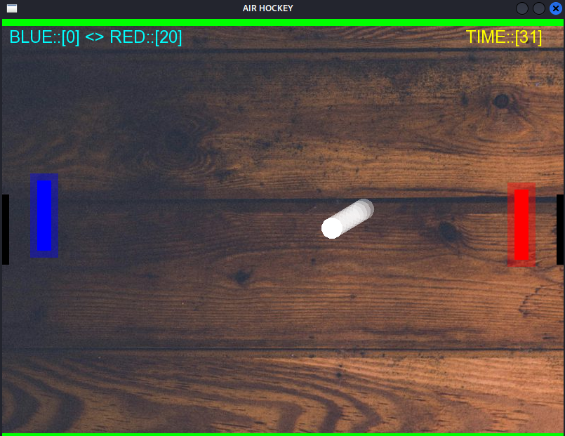

# Air Hockey Game
<p align="center">
  
</p>

## Description
This is a simple Air Hockey game implemented using SFML (Simple and Fast Multimedia Library). The game features two paddles (one controlled by the player and the other by AI), a ball, and a 60-second timer. The objective is to score as many goals as possible before the timer runs out.

## Features
- **Player Paddle**: Controlled using the `W` (up) and `S` (down) keys.
- **AI Paddle**: Automatically moves to track the ball's position.
- **Ball Physics**: The ball bounces off the walls and paddles, and goals are detected when the ball enters the goal areas.
- **Scoring**: Each goal scores 10 points for the respective player.
- **Timer**: The game lasts for 60 seconds, after which the final scores are displayed.
- **Sound Effects**: Includes sound effects for ball hits and goals.
- **Visual Effects**: Glow effects around paddles and a ball trail effect.

## Controls
- **W**: Move player paddle up.
- **S**: Move player paddle down.

## Requirements
- **SFML**: The game uses SFML for graphics, audio, and window management. Make sure SFML is installed on your system.
- **Font File**: The game uses the `arial.ttf` font file. Ensure it is present in the same directory as the executable.
- **Sound Files**: The game uses `hit.wav` and `goal.wav` for sound effects. Ensure these files are present in the same directory as the executable.
- **Background Image**: The game uses `1.jpg` as the background image. Ensure it is present in the same directory as the executable.

## Installation
1. Clone the repository or download the source code.
2. Ensure all required files (`arial.ttf`, `hit.wav`, `goal.wav`, `1.jpg`) are in the same directory as the executable.
3. Compile the code using a C++ compiler with SFML linked. For example:
   ```bash
   g++ -o air_hockey main.cpp -lsfml-graphics -lsfml-window -lsfml-system -lsfml-audio

